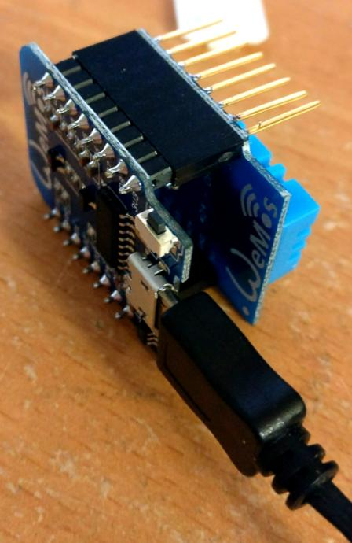

# Wemos temperature broadcast

This is an example project for [LUT](http://www.lut.fi) course
[Johdanto sulautettuihin järjestelmiin](http://moodle.lut.fi/course/info.php?id=4044).

The project consists of two main parts:

* an embedded application running on [Wemos D1 mini](https://www.wemos.cc/product/d1-mini.html),
  which broadcasts temperature measurements from [DHT-11 shield](https://www.wemos.cc/product/dht-shield.html)
  to local network with UDP
* a minimal Python -server to receive the data

## Introduction to the idea

For the third part, the idea is to use the various
[shields](https://www.wemos.cc/D1-mini-Shields) available for the Wemos D1 to
utilize the data. The third part is to be implemented by the groups during the course.

Some examples include:

* logging the values to a SD card
* displaying the current value on OLED display
* step / servo motor to control shunt
* relay to control heating
* RGB LED to translate the current value as color
    * could also be used to show relay / shunt status
* HTTP server (accessible with phone, tablet, PC, ...) to display the measurement data

## Programming

The programming language is [Arduino](https://www.arduino.cc/), which is

> merely a set of C/C++ functions that can be called from your code.
>
> -- <cite>[Arduino FAQ](https://www.arduino.cc/en/Main/FAQ)</cite>

### Setting up the development environment

Setting up the development environment can be done following the manual at the
[Wemos website](https://www.wemos.cc/tutorial/get-started-arduino.html).

### Required libraries

* [Adafruit Unified Sensor Driver](https://github.com/adafruit/Adafruit_Sensor)
* [Adafruit DHT Humidity & Temperature Unified Sensor Library](https://github.com/adafruit/DHT-sensor-library)
* [ArduinoJson](https://github.com/bblanchon/ArduinoJson)

## Notes

### Mesh networking vs UDP

This application could very well use the mesh networking capabilities of the ESP2866
to interract between the devices. By using mesh networking, the devices could
communicate directly between them, without a need for existing WiFi network.

However, UDP was selected as means of communication to allow listening for messages
on devices other than Wemos. This allows integration of the devices to a larger
system, for example a home automation system running on an embedded Linux device.
